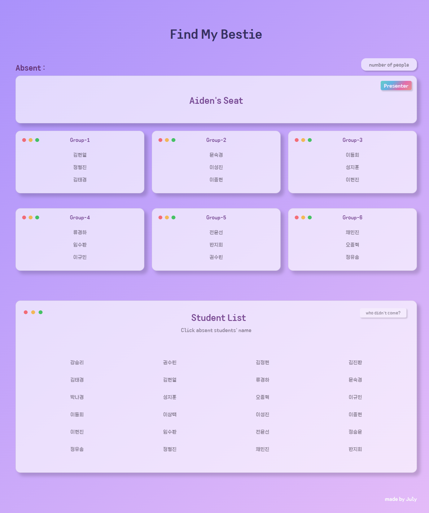
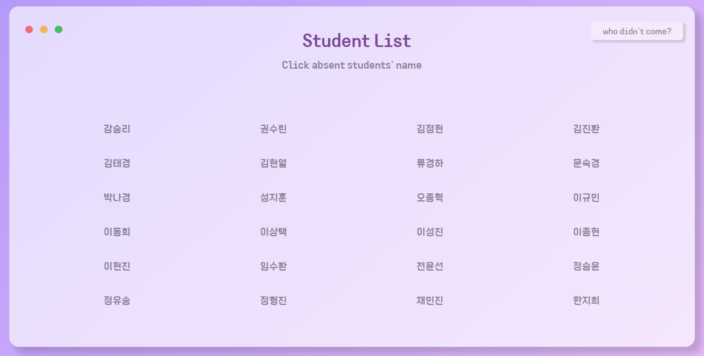
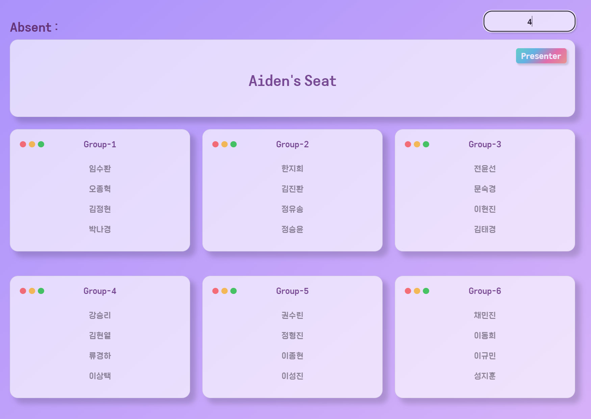
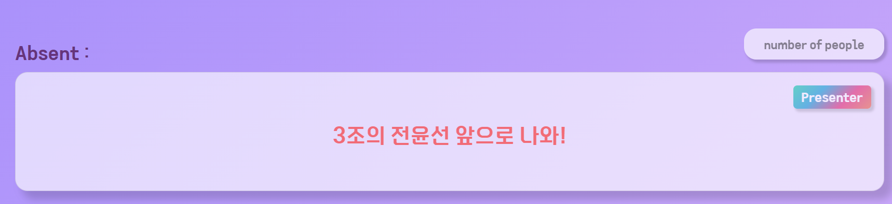

   

# 👭Find My Bestie : 단짝 좀 찾아줘👨🏻‍🤝‍👨🏻

***

## 😮What is this?

Find My Bestie는 랜덤으로 조를 생성하고 랜덤으로 발표자를 뽑는 프로그램입니다. 기존 있는 서비스이지만 조 뽑기와 발표자 뽑기가 분리되어있어 불편했기에 둘을 합쳐보고자 만들게 되었습니다. 

HTML 한 장으로 만들었기 때문에 인터넷 연결이 안되있어도 사용이 가능하고 가벼운 장점이 있습니다. 또한 LocalStorage에 그룹들을 저장하기에 재사용도 용이합니다.코딩을 모르는 사람도 HTML의 학생 이름부분만 변경하면 되기 때문에 쉽고 간단하게 이용할 수 있게 만들었습니다.

 

# 🤼‍♂️ 서비스 주요 내용

- 결석자를 제외하고 랜덤으로 조를 만들 수 있습니다.
- 랜덤으로 발표자를 선출할 수 있습니다  

***

## 📚 STACKS  

    
    
    
    

  

***
# 📖How to use?
### 1. 결석 학생 학생명단에서 제외시키기  

__두 가지 방법이 있습니다__  

- 결석한 학생의 이름을 클릭
- 검색창에 결석한 학생의 이름을 검색 

다시 활성화 시키고싶으면 그 학생을 클릭하거나 검색하면 활성화됩니다. 교탁 위에 Absent에서 결석한 학생들을 확인할 수 있습니다.

_주의 : 학생을 결석시키면 조가  초기화됩니다!_  

  

### 2. 조 편성하기

`number of people` 검색창에 조원수를 입력하고 Enter를 누르면 랜덤으로 조편성이 됩니다!
LocalStorage에 편성된 조를 저장하였기에 새로고침해도 조가 바뀌지 않습니다.

  

### 3. 발표자 뽑기

`Presenter`버튼을 클릭해 발표자를 랜덤으로 선출합니다.
발표자가 뽑히면 3초동안 🎀핑크색🎀으로 발표자를 가르킵니다.

  

  

​    

***

# 🚧 👷‍♀️⛏개선할 점👷🔧️ 🚧

#### 🎈코멘트와 이슈는 언제든 환영입니다🎈

- 결석 학생 또한 LocalStorage에 저장해 불러오기
  - Student List에 비활성화 상태로 만들어야 함
  - Absent 리스트에 보여야함
- 조원이 다른 조에 비해 월등히 적은 경우! : 다른 조 인원을 줄여서 나누기
  - 사람 수 / 조 갯수로 convert 하는 기능 구현 예정
  - 마지막 조에 사람이 몇명인지 알려주는 alert창 띄우고 조 만들기

- 패드보다 작은 사이즈에서는 반응형 view가 형성되지 않는다!
- ~~number of people에 숫자만 입력되게 바꾸기~~ : 🤗22.07.05 업데이트🤗
- ~~조를 만드는 중에는 number of people이 입력되어도 실행하지 않기~~ : 🤗22.07.05 업데이트🤗

